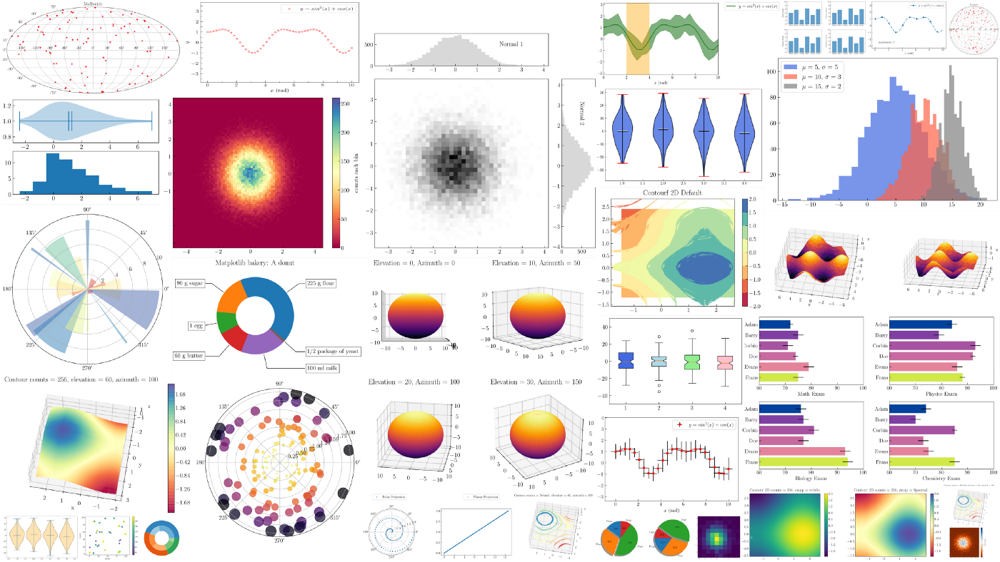

# niftyAnalysis
<h2>Pyspark Exercise on Data Visualization Process</h2>

About: 
The NIFTY 50 is a benchmark Indian stock market index that represents the weighted average of 50 of the largest Indian companies listed on the National Stock Exchange.

<b>Data Visualization</b> is the process of presenting data in the form of graphs or charts. It helps to understand large and complex amounts of data very easily. It allows the decision-makers to make decisions very efficiently and also allows them in identifying new trends and patterns very easily. It is also used in high-level data analysis for Machine Learning and Exploratory Data Analysis (EDA).  Data visualization can be done with various tools like Tableau, Power BI, Python. 

<b>Matplotlib<b> is a low-level library of Python which is used for data visualization. It is easy to use and emulates MATLAB like graphs and visualization. This library is built on the top of NumPy arrays and consist of several plots like line chart, bar chart, histogram, etc. It provides a lot of flexibility but at the cost of writing more code.

<b>Installation</b> 
To install Matplotlib type the below command in the terminal. 
<pre>pip install matplotlib</pre>

Tools Used:
-VSCode [IDE]

Libaries & Frameworks Used:
-Pyspark
-Pandas
-Matplotlib
